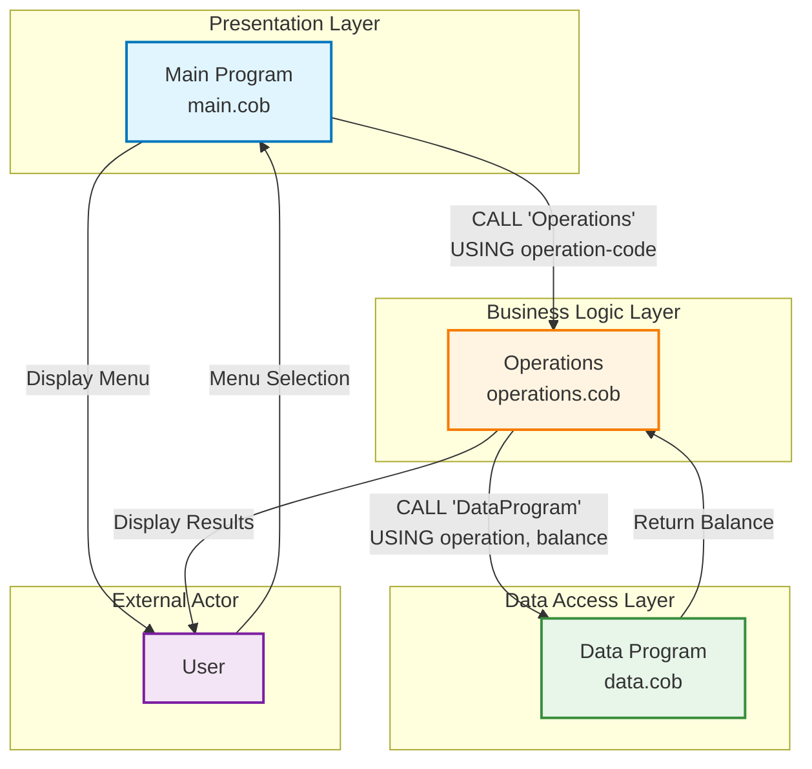
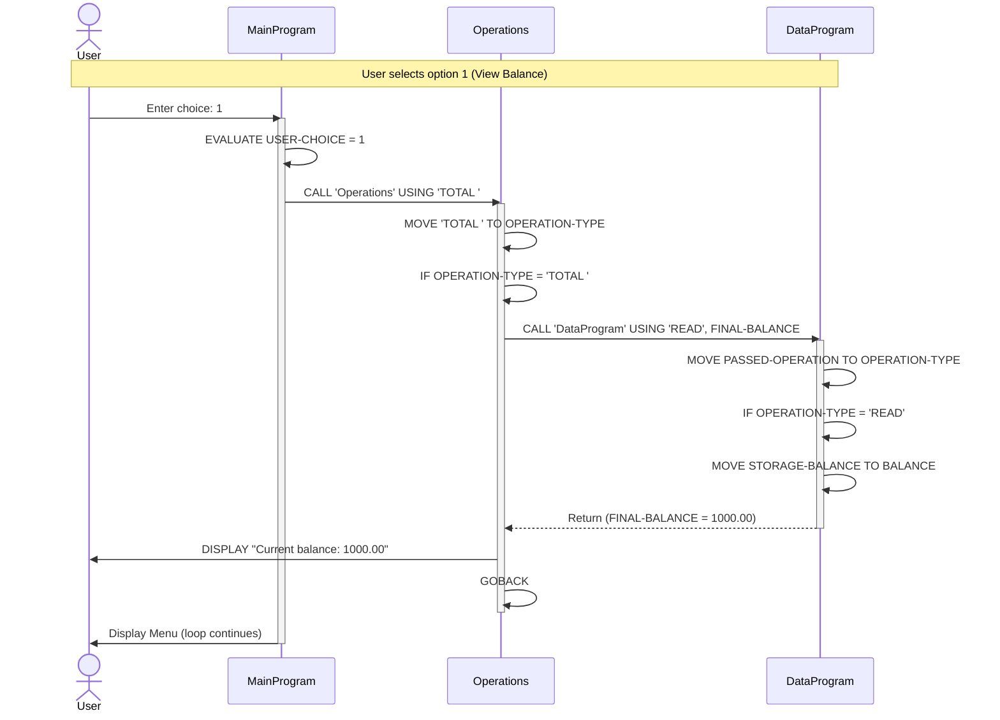
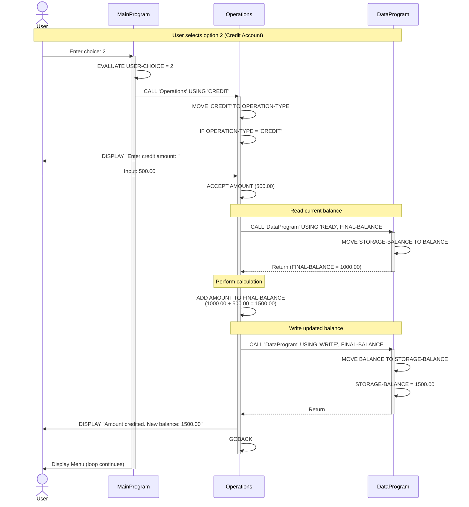
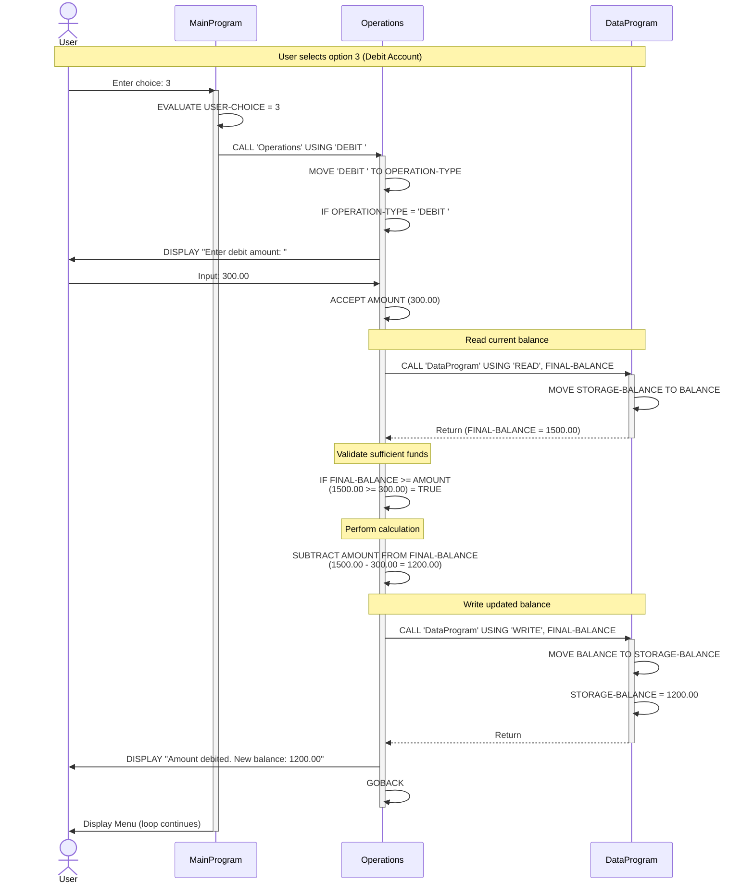
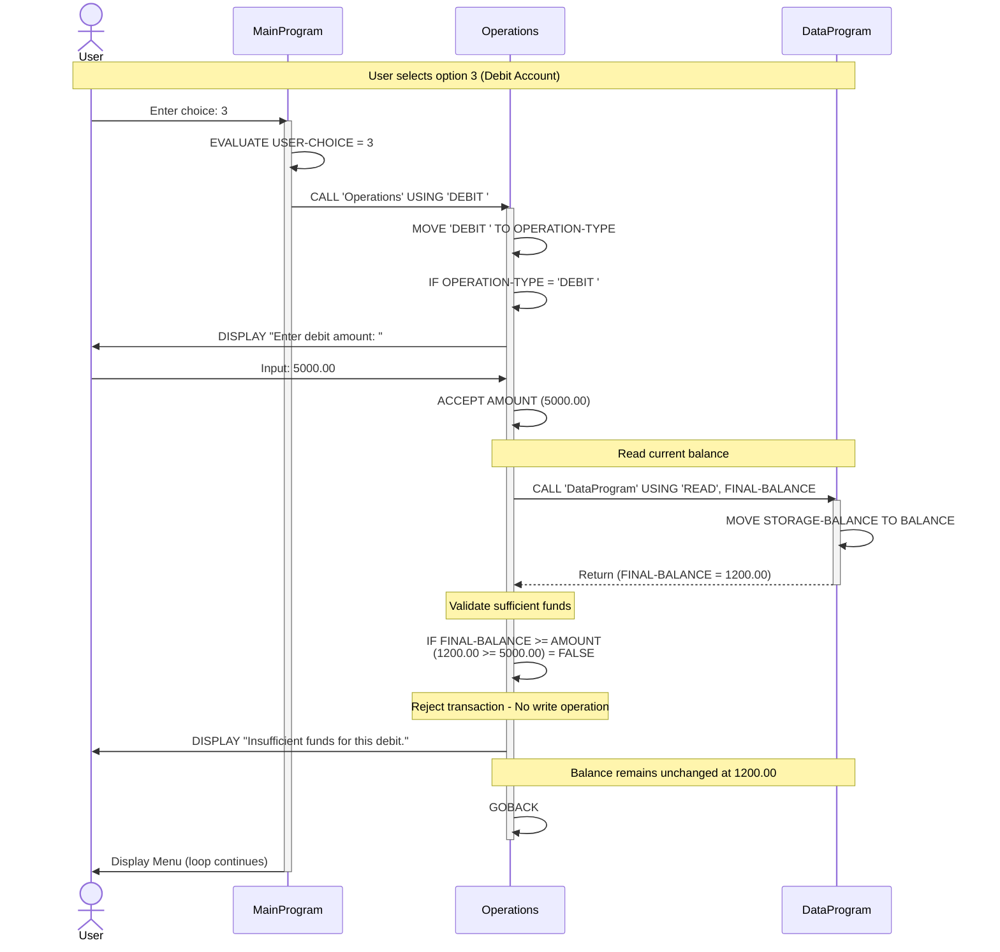
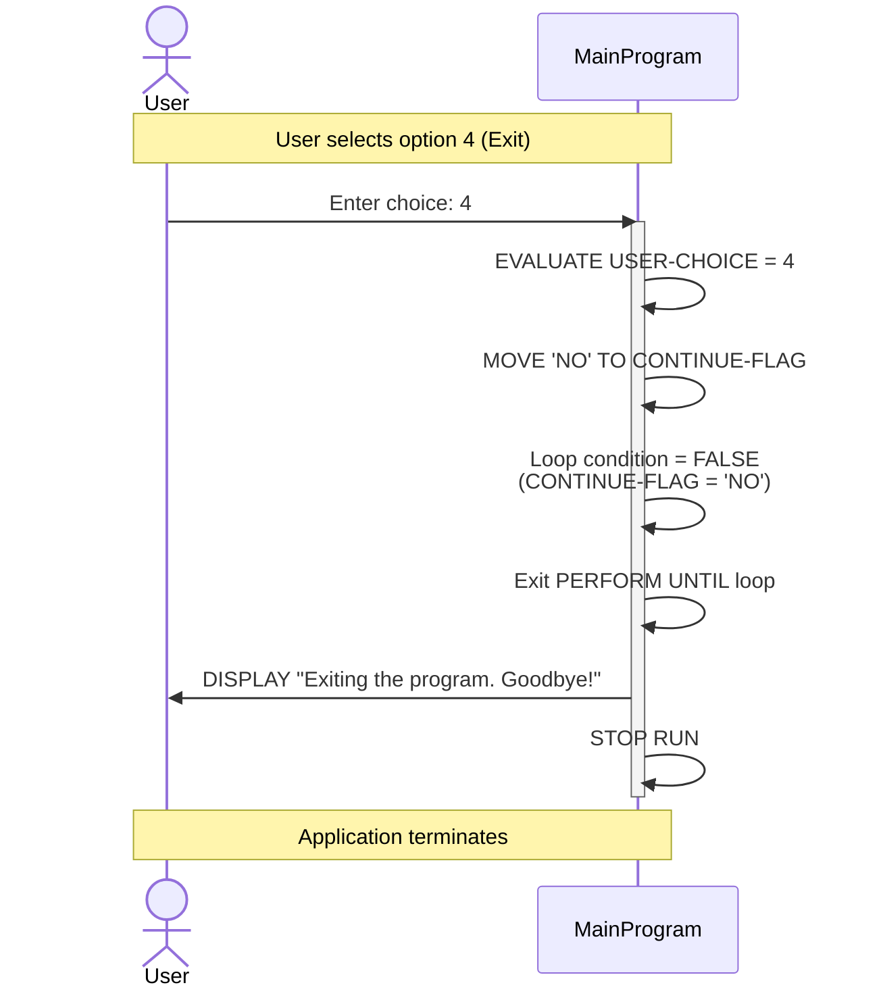
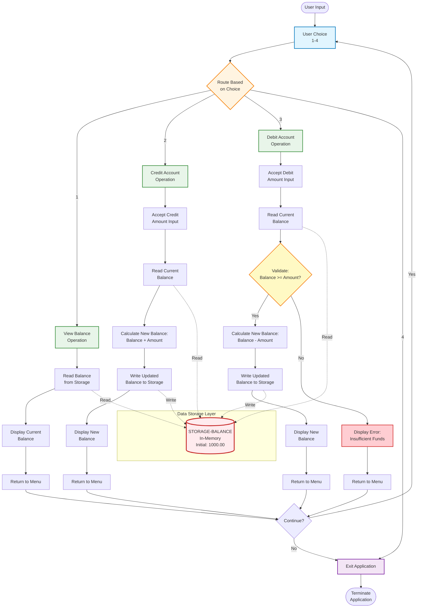
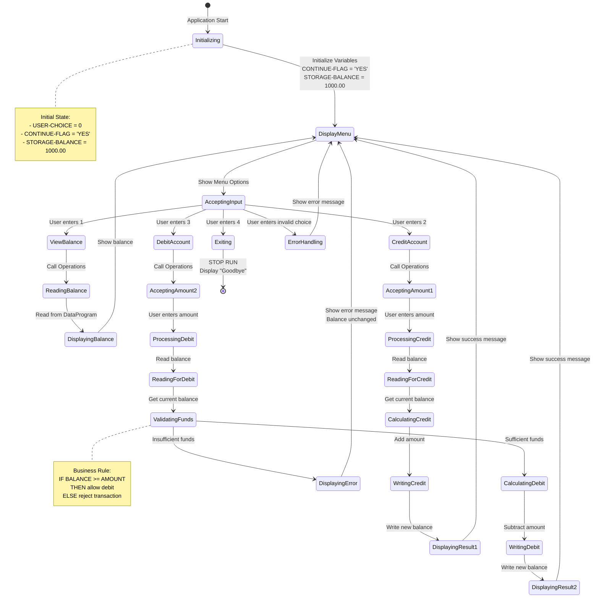
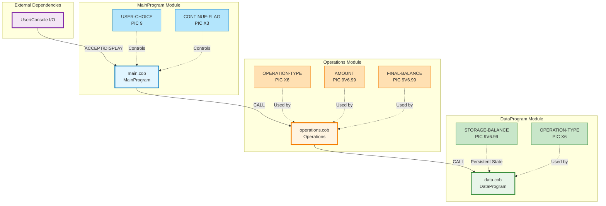

# 📊 System Architecture and Data Flow Diagrams

This document contains visual diagrams showing the architecture, data flow, and component interactions of the COBOL Account Management System. All diagrams use Mermaid format for GitHub rendering.

---

## Table of Contents

1. [High-Level System Architecture](#1-high-level-system-architecture)
2. [Component Interaction Diagram](#2-component-interaction-diagram)
3. [Detailed Sequence Diagrams](#3-detailed-sequence-diagrams)
   - [View Balance Flow](#view-balance-flow)
   - [Credit Account Flow](#credit-account-flow)
   - [Debit Account Flow (Sufficient Funds)](#debit-account-flow-sufficient-funds)
   - [Debit Account Flow (Insufficient Funds)](#debit-account-flow-insufficient-funds)
   - [Exit Application Flow](#exit-application-flow)
4. [Data Flow Diagram](#4-data-flow-diagram)
5. [State Machine Diagram](#5-state-machine-diagram)
6. [Module Dependency Graph](#6-module-dependency-graph)

---

## 1. High-Level System Architecture

This diagram shows the three-tier layered architecture of the COBOL application.



**Legend:**
- **Presentation Layer (Blue)**: User interface and menu management
- **Business Logic Layer (Orange)**: Transaction processing and business rules
- **Data Access Layer (Green)**: Data storage and retrieval
- **External Actor (Purple)**: End user interaction

---

## 2. Component Interaction Diagram

This diagram shows the detailed component structure and their relationships.

```mermaid
graph LR
    subgraph "MainProgram Components"
        MP[Main Logic]
        UC[USER-CHOICE<br/>PIC 9]
        CF[CONTINUE-FLAG<br/>PIC X(3)]
    end
    
    subgraph "Operations Components"
        OP[Operation Logic]
        OT[OPERATION-TYPE<br/>PIC X(6)]
        AM[AMOUNT<br/>PIC 9(6)V99]
        FB[FINAL-BALANCE<br/>PIC 9(6)V99]
    end
    
    subgraph "DataProgram Components"
        DP[Data Access Logic]
        SB[STORAGE-BALANCE<br/>PIC 9(6)V99]
        DT[OPERATION-TYPE<br/>PIC X(6)]
    end
    
    MP -->|CALL with<br/>'TOTAL'/'CREDIT'/'DEBIT'| OP
    OP -->|CALL with<br/>'READ'/'WRITE'| DP
    UC -.->|Controls| MP
    CF -.->|Controls| MP
    OT -.->|Determines| OP
    AM -.->|Input to| OP
    FB -.->|Working storage| OP
    SB -.->|Persistent state| DP
    DT -.->|Determines| DP
    
    style MP fill:#e1f5ff,stroke:#0277bd,stroke-width:2px
    style OP fill:#fff4e1,stroke:#f57c00,stroke-width:2px
    style DP fill:#e8f5e9,stroke:#388e3c,stroke-width:2px
    style UC fill:#ffebee,stroke:#c62828,stroke-width:1px
    style CF fill:#ffebee,stroke:#c62828,stroke-width:1px
    style OT fill:#fff9c4,stroke:#f57f17,stroke-width:1px
    style AM fill:#fff9c4,stroke:#f57f17,stroke-width:1px
    style FB fill:#fff9c4,stroke:#f57f17,stroke-width:1px
    style SB fill:#c8e6c9,stroke:#2e7d32,stroke-width:1px
    style DT fill:#c8e6c9,stroke:#2e7d32,stroke-width:1px
```

**Legend:**
- **Solid arrows**: Program calls
- **Dotted arrows**: Data dependencies
- **Blue boxes**: Presentation layer components
- **Orange boxes**: Business logic components
- **Green boxes**: Data layer components
- **Light red boxes**: Control variables
- **Light yellow boxes**: Business data variables
- **Light green boxes**: Storage variables

---

## 3. Detailed Sequence Diagrams

### View Balance Flow

This sequence diagram shows the complete flow when a user views their account balance.



---

### Credit Account Flow

This sequence diagram shows the complete flow when a user credits their account.



---

### Debit Account Flow (Sufficient Funds)

This sequence diagram shows the flow when a user debits their account with sufficient funds.



---

### Debit Account Flow (Insufficient Funds)

This sequence diagram shows the flow when a user attempts to debit more than their balance.



---

### Exit Application Flow

This sequence diagram shows the flow when a user exits the application.



---

## 4. Data Flow Diagram

This diagram illustrates how data enters, transforms, and flows through the system.



**Data Transformation Points:**

1. **Input Stage**: User input (1-4) → Menu choice validation
2. **Amount Input**: User amount input → Numeric value (PIC 9(6)V99)
3. **Read Operation**: Storage balance → Working balance
4. **Credit Calculation**: Working balance + Amount → New balance
5. **Debit Validation**: Working balance vs Amount → Boolean decision
6. **Debit Calculation**: Working balance - Amount → New balance
7. **Write Operation**: New balance → Storage balance (persistent)
8. **Display Stage**: Numeric balance → Formatted display string

---

## 5. State Machine Diagram

This diagram shows the application's state transitions based on user actions.



**State Descriptions:**

- **Initializing**: Application starts, variables initialized
- **DisplayMenu**: Menu displayed to user, waiting for input
- **AcceptingInput**: Capturing user's menu choice
- **ViewBalance**: Processing view balance request
- **CreditAccount**: Processing credit transaction
- **DebitAccount**: Processing debit transaction
- **ValidatingFunds**: Checking for sufficient funds (business rule)
- **ErrorHandling**: Displaying error for invalid input
- **Exiting**: Terminating application gracefully

---

## 6. Module Dependency Graph

This diagram shows the dependency relationships between program modules and their data structures.



**Dependency Summary:**

| Module | Depends On | Called By | Data Dependencies |
|--------|-----------|-----------|-------------------|
| MainProgram | Operations | None (Entry Point) | USER-CHOICE, CONTINUE-FLAG |
| Operations | DataProgram | MainProgram | OPERATION-TYPE, AMOUNT, FINAL-BALANCE |
| DataProgram | None | Operations | STORAGE-BALANCE, OPERATION-TYPE |

**Call Hierarchy:**
```
User
 └── MainProgram (main.cob)
      └── Operations (operations.cob)
           └── DataProgram (data.cob)
```

**No Circular Dependencies**: The application follows a clean unidirectional call hierarchy with no circular dependencies.

---

## Summary

These diagrams provide comprehensive visualization of:

1. **System Architecture**: Three-tier layered architecture (Presentation, Business Logic, Data Access)
2. **Component Interactions**: How modules and data structures interact
3. **Sequence Flows**: Step-by-step execution paths for all operations
4. **Data Transformations**: How data flows and transforms through the system
5. **State Management**: Application states and transitions
6. **Module Dependencies**: Clear dependency relationships

All diagrams are in Mermaid format and will render properly on GitHub. These visualizations support the modernization effort by clearly documenting the current system's behavior and structure.

---

**Document Version**: 1.0  
**Created**: 2025-11-05  
**Purpose**: Phase 1 - Analysis & Understanding (Issue #3)  
**Next Steps**: Use these diagrams to guide the Node.js conversion (Issue #5)
